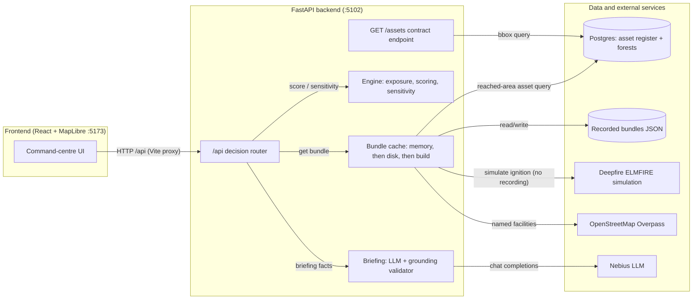

# FireProtector architecture

How a request flows through the decision layer.

The UI only talks to `/api`. Each route asks for the scenario's *bundle*: the
fire-spread forecast, the reached assets and the exposure join. A bundle comes
from memory, then from a recorded JSON file (`backend/data/bundles/`). Only if
neither exists does it run a live Deepfire simulation (minutes), pull register
assets from Postgres and named facilities from OpenStreetMap, and record the
result. The engine ranks assets and tests how stable the ranking is. The
briefing service turns the top results into a trilingual briefing via the LLM,
checked by a validator, with templates as the fallback.

Notes:

- `GET /assets` is the shared contract endpoint; it reads Postgres directly and
  is separate from the decision flow.
- `GET /fire/arrival-grid` (Deepfire exposed directly) is omitted for brevity.
- The template fallback is inferred from `briefing/templates.py` sitting beside
  `llm.py`.
